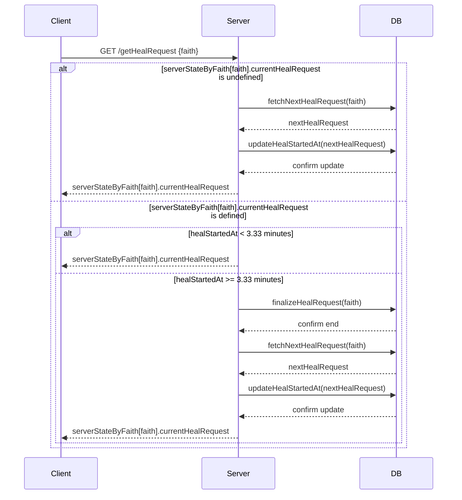

# Websocket Express Server using Typescript

Followed guide https://medium.com/@vitaliykorzenkoua/working-with-websocket-in-node-js-using-typescript-1aebb8a06bd6

Public:

- Public URL and Socket.io: [heal-together-backend.onrender.com](https://heal-together-backend.onrender.com)
- Backend Logs: [dashboard.render.com](https://dashboard.render.com/web/srv-clpm8map0o1s73ban9q0/logs)
- DB at Baserow.io: [baserow.io](https://baserow.io/database/83536/table/227602/374517)

Docs:

- Socket.io Docs: https://socket.io/docs/v4/handling-cors/
- DB API Docs: https://baserow.io/api-docs/database/83536

Local:

- Local server: http://localhost:3001
- Local websocket: ws://localhost:3001

Start dev server with:

```
yarn; yarn build
yarn dev
```

Run in production with:

```
yarn; yarn build
yarn start
```

Start test client with:

```
yarn client
```

Connect to prod client:

```
yarn prod-client
```

In client expect to see message:

```
Connected to server
Received message from server: UEvbArHfLMt88bWusXdBM
Received message from server: Hello, server!
```

Then, in Websocket server expect to see:

```
PORT Listen At 3001
Server at localhost:3001
Websocket at ws://localhost:3001
New connection, active healers: 1
```

UML for API /genHealRequest


